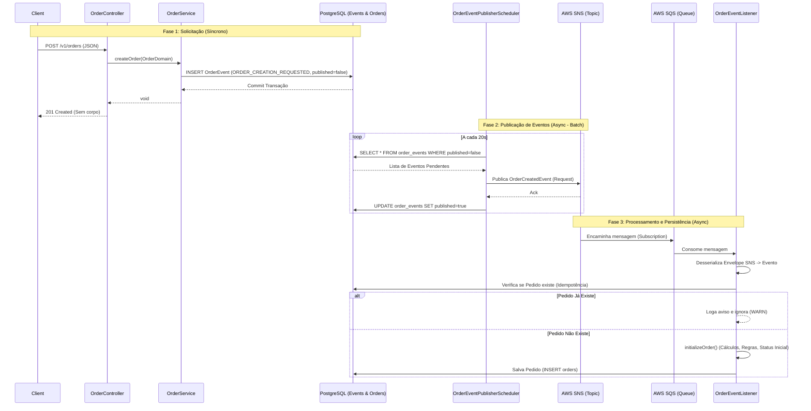

# Documentação da API - MS Order

Esta documentação detalha os endpoints disponíveis no microsserviço de pedidos (`ms-order`) e explica o fluxo assíncrono de criação de pedidos utilizando o padrão **Transactional Outbox** com **AWS SNS** e **SQS**.

## 1. Visão Geral do Fluxo de Criação (Transactional Outbox)

O processo de criação de um pedido utiliza o padrão **Transactional Outbox** para garantir consistência entre a persistência no banco de dados e a publicação de eventos no message broker (SNS).

O fluxo foi desenhado seguindo o padrão **Command/Request**, onde a API apenas registra a intenção de criação, e o processamento real (regras de negócio, cálculos, persistência do pedido) ocorre assincronamente.

### Diagrama de Funcionamento



---

## 2. Endpoints

### 2.1. Criar Pedido
Inicia o processo de criação de um pedido. Este endpoint é **assíncrono** e utiliza o padrão Outbox.

- **URL**: `/v1/orders`
- **Método**: `POST`
- **Status de Sucesso**: `201 Created`
- **Corpo da Resposta**: Vazio.

**Exemplo de Requisição (cURL):**
```bash
curl -X POST http://localhost:8080/v1/orders \
  -H "Content-Type: application/json" \
  -d '{
    "customerId": "550e8400-e29b-41d4-a716-446655440000",
    "items": [
      {
        "productId": "a1b2c3d4-e5f6-7890-1234-567890abcdef",
        "productName": "Smartphone XYZ",
        "productSku": "SKU-12345",
        "quantity": 1,
        "unitPrice": 999.99,
        "discount": 50.00
      }
    ],
    "shippingAddress": {
      "street": "Rua das Flores, 123",
      "city": "São Paulo",
      "state": "SP",
      "zipCode": "01001-000"
    },
    "notes": "Entregar na portaria"
  }'
```

---

### 2.2. Listar Pedidos
Retorna todos os pedidos processados e salvos no banco de dados.

- **URL**: `/v1/orders`
- **Método**: `GET`
- **Status de Sucesso**: `200 OK`

**Exemplo de Resposta:**
```json
[
  {
    "id": "3fa85f64-5717-4562-b3fc-2c963f66afa6",
    "orderNumber": "7EA883AB",
    "customerId": "550e8400-e29b-41d4-a716-446655440000",
    "totalAmount": 949.99,
    "status": "PENDING",
    "createdAt": "2024-02-19T18:30:00"
  }
]
```

---

### 2.3. Buscar Pedido por ID
Retorna os detalhes de um pedido específico.

- **URL**: `/v1/orders/{id}`
- **Método**: `GET`
- **Status de Sucesso**: `200 OK`
- **Status de Erro**: `404 Not Found`

**Exemplo de Requisição:**
```bash
curl -X GET http://localhost:8080/v1/orders/3fa85f64-5717-4562-b3fc-2c963f66afa6
```

---

## 3. Detalhes do Fluxo (Transactional Outbox)

1.  **Entrada (Entrypoint)**:
    *   O `OrderController` recebe o DTO `CreateOrderRequest`.
    *   O `OrderEntrypointMapper` converte o request para o domínio `Order`.

2.  **Serviço (Core)**:
    *   O `OrderService` recebe o objeto de domínio.
    *   Cria um `OrderEvent` (Outbox) do tipo `ORDER_CREATION_REQUESTED` com `published=false` contendo os dados brutos do pedido.
    *   Salva **apenas o Evento** no banco de dados. O pedido ainda não existe na tabela `orders`.
    *   **Log**: `[SERVICE] Order Request Event saved successfully.`

3.  **Publicação (Scheduler - Batch)**:
    *   O `OrderEventPublisherScheduler` roda a cada 20 segundos.
    *   Busca eventos com `published=false` no banco.
    *   Reconstrói o `OrderCreatedEvent` a partir do payload salvo usando `ObjectMapper`.
    *   Publica no SNS via `IOrderEventPublisherPort`.
    *   Atualiza o evento no banco para `published=true`.
    *   **Log**: `[SCHEDULER] Event published successfully.`

4.  **Fila (Infrastructure - SQS)**:
    *   O tópico SNS possui uma assinatura que encaminha a mensagem para a fila SQS `order-events-queue`.
    *   O SNS envia a mensagem encapsulada em um envelope JSON padrão.

5.  **Consumo (Infrastructure - Listener)**:
    *   O `OrderEventListener` escuta a fila SQS.
    *   Recebe a mensagem bruta (String) e extrai o payload do envelope SNS.
    *   Verifica se o pedido já existe no banco pelo `orderNumber` (Idempotência).
    *   Se não existir:
        *   Chama `initializeOrder()` para aplicar regras de negócio, calcular totais e gerar `orderNumber`.
        *   Salva o pedido na tabela `orders`.
    *   **Log**: `[LISTENER] Order processed and saved successfully.`
