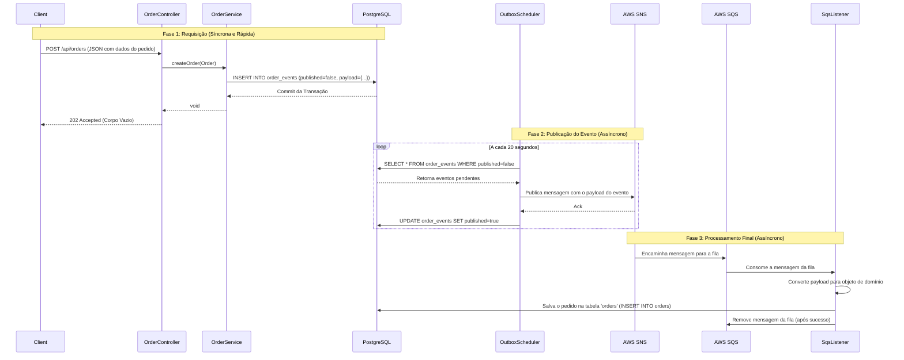

# Documentação da API - MS Order

Esta documentação detalha os endpoints disponíveis no microsserviço de pedidos (`ms-order`) e explica o fluxo assíncrono de criação de pedidos.

## 1. Fluxo Principal: Criação de Pedido Assíncrona

O processo de criação de um pedido utiliza o padrão **Transactional Outbox** para garantir consistência e resiliência. A API apenas registra a intenção de criação, e o processamento real ocorre em background.

### Diagrama de Sequência

O diagrama abaixo ilustra o fluxo "event-first" implementado:



### Detalhes do Fluxo

#### Fase 1: A Requisição (Síncrona e Rápida)

1.  **Recebimento:** O `OrderController` recebe a requisição HTTP.
2.  **Geração do Evento:** O `OrderService` é chamado, cria um `OrderEvent` com todos os dados da requisição no `payload` e o status `published = false`.
3.  **Persistência Atômica:** Na mesma transação, o `OrderRepositoryAdapter` salva **apenas o evento** na tabela `order_events`. O pedido ainda não existe na tabela `orders`.
4.  **Resposta Rápida:** A API retorna `HTTP 202 Accepted`, liberando o cliente imediatamente.

#### Fase 2: O Processamento em Background (Assíncrono)

1.  **O Scheduler:** A cada 20 segundos, o `OrderEventPublisherScheduler` busca por eventos com `published = false`.
2.  **Publicação na Mensageria:** Para cada evento, ele o publica no tópico SNS `order-events-topic`.
3.  **Atualização do Evento:** Após a publicação, o evento no banco é marcado como `published = true`.

#### Fase 3: O Consumo do Evento

1.  **O Listener:** O `SqsListener` consome a mensagem da fila `order-events-queue`.
2.  **Criação do Pedido:** O Listener extrai o `payload` e executa a lógica para criar e salvar o `Order` e seus itens no banco de dados.
3.  **Remoção da Mensagem:** Após o sucesso, a mensagem é removida da fila para garantir que não seja processada em duplicidade.

---

## 2. Endpoints da API

### 2.1. Criar Pedido

Inicia o processo de criação assíncrona de um pedido.

-   **URL**: `/api/orders`
-   **Método**: `POST`
-   **Status de Sucesso**: `202 Accepted`
-   **Corpo da Resposta**: Vazio

**Exemplo de Requisição (cURL):**

```bash
curl -X POST http://localhost:8080/api/orders \
  -H "Content-Type: application/json" \
  -d '{
    "customerId": "550e8400-e29b-41d4-a716-446655440000",
    "items": [
      {
        "productId": "a1b2c3d4-e5f6-7890-1234-567890abcdef",
        "productName": "Smartphone XYZ",
        "productSku": "SKU-12345",
        "quantity": 1,
        "unitPrice": 999.99
      }
    ],
    "shippingAddress": {
      "street": "Rua Teste",
      "city": "São Paulo",
      "state": "SP",
      "zipCode": "00000-000"
    }
  }'
```

### 2.2. Buscar Pedido por ID

Retorna os detalhes de um pedido específico. Este endpoint consulta o cache Redis antes de ir ao banco de dados.

-   **URL**: `/api/orders/{id}`
-   **Método**: `GET`
-   **Status de Sucesso**: `200 OK`
-   **Status de Erro**: `404 Not Found`

**Exemplo de Requisição:**

```bash
curl -X GET http://localhost:8080/api/orders/3fa85f64-5717-4562-b3fc-2c963f66afa6
```

**Exemplo de Resposta:**

```json
{
  "id": "3fa85f64-5717-4562-b3fc-2c963f66afa6",
  "orderNumber": "7EA883AB",
  "customerId": "550e8400-e29b-41d4-a716-446655440000",
  "totalAmount": 999.99,
  "status": "PENDING",
  "items": [
      {
          "id": "...",
          "productId": "a1b2c3d4-e5f6-7890-1234-567890abcdef",
          "productName": "Smartphone XYZ",
          "quantity": 1,
          "unitPrice": 999.99,
          "subtotal": 999.99
      }
  ],
  "createdAt": "2024-02-19T18:30:00",
  "updatedAt": "2024-02-19T18:30:00"
}
```